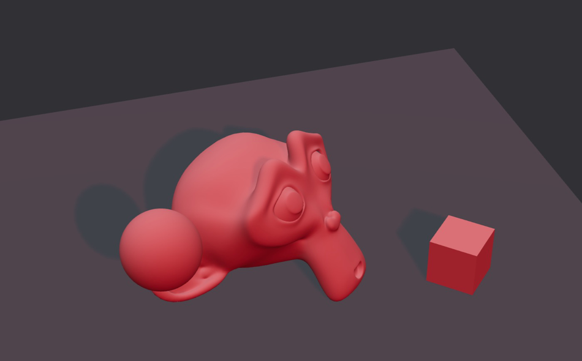
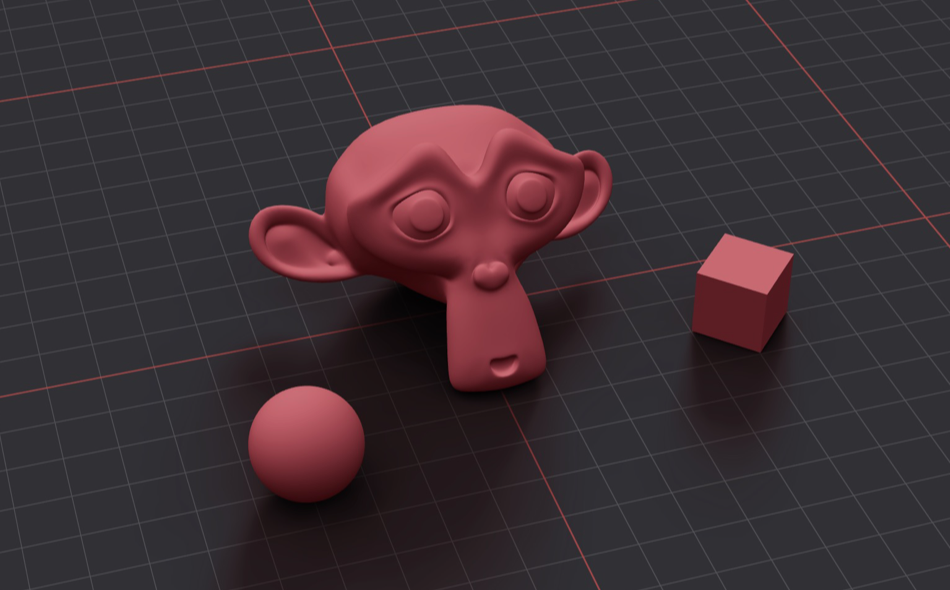
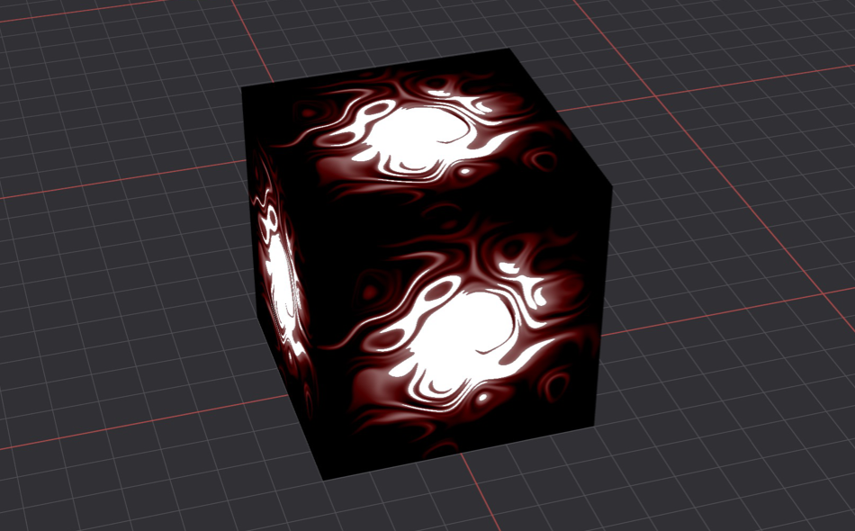
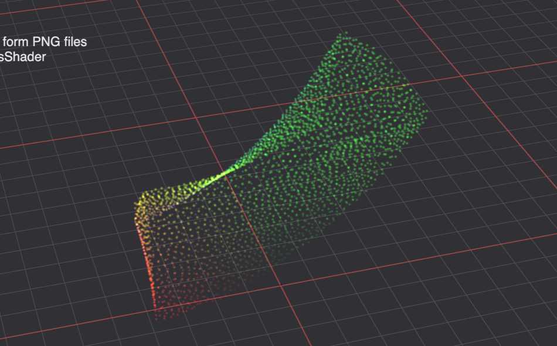

# React Three Fiber (R3F) Samples

## What is it?
My collection of sample codes of R3F.

## Run
    nvm use 18.14.2
    npm run dev

## Notes
This project used [React Router](https://reactrouter.com/en/main/start/tutorial) to setup the pages navigation.

## GitHub
https://github.com/rc-bellergy/R3F-samples

## Previews

