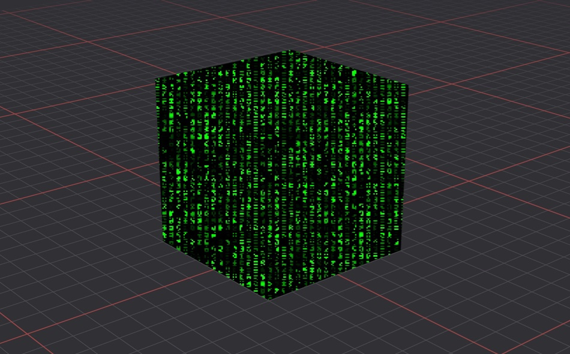

# React Three Fiber (R3F) Samples

## What is it?
My collection of sample codes of R3F.

## Run
    nvm use 18.14.2
    npm run dev

## Notes
This project used [React Router](https://reactrouter.com/en/main/start/tutorial) to setup the pages navigation.

## GitHub
https://github.com/rc-bellergy/R3F-samples

## Demo Site
https://designquest.com.hk/demo/R3F/#/samples/01

## Previews
\
01 Simple Animation

\
02 Grid & Fine Shadows

\
03 Custom Shader with animation

\
04 Particles Shader with loading PNG 16-bit bufferArray

\
05 Handle Hover and Click events

\
06 gltf to jsx / modify gltf / embed HTML to component / Using Suspense and Laoding animation